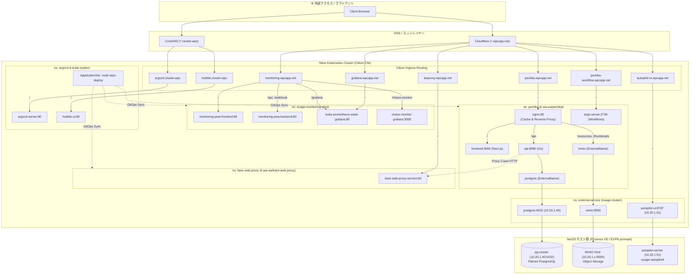

# サービス間依存グラフ & カタログ

このドキュメントは `generate-service-graph` スキルにより各リポジトリのマニフェストから自動生成されたものである。手動での直接編集は行わず、マニフェスト変更後にスクリプトを再実行すること。

<!-- BEGIN:AUTOGEN_SERVICE_GRAPH -->

### サービス間依存グラフ (Mermaid)

### サービスカタログ

| リポジトリ | Namespace | 公開ドメイン / Ingress | 内部 Service | 外部・他サービス依存先 | デプロイ方式 |
| :-- | :-- | :-- | :-- | :-- | :-- |
| `pechka` | `pechka` | `pechka.wpcapp.net` `pechka-workflow.wpcapp.net` | `nginx:80` `frontend:3000` `api:8080` `argo-server:2746` | • `bare-web-proxy-service` (HTTP) • `pg-cluster` (10.20.1.40:5432) • `minio` (10.20.1.x:9000) • Sakura AI API | Argo CD (`multi-repo-deploy`) |
| `bare-web-proxy` | `bare-web-proxy` | `bwproxy.wpcapp.net` | `bare-web-proxy-service:80` | なし (独立プロキシ) | Argo CD (`multi-repo-deploy`) |
| `nuage-monitoring-stack` | `monitoring` | `monitoring.wpcapp.net` `grafana.wpcapp.net` | `monitoring-pwa-frontend:80` `monitoring-pwa-backend:80` `kube-prometheus-stack-grafana:80` `chaos-monitor-grafana:3000` | • Prometheus • Alertmanager | Argo CD (`multi-repo-deploy`) |
| `nuage-autopilot4` | `external-service` | `autopilot-ui.wpcapp.net` | `autopilot-ui:8787` | • NixOS VM (`autopilot-server`: 10.20.1.51) • GitHub API • Ollama (`192.168.5.222`) | NixOS / Systemd + K8s External Endpoint |
| `nuage-cluster` | `argocd` `kube-system` | `argocd.cluster.wpc` `hubble.cluster.wpc` | `argocd-server:80` `hubble-ui:80` | • Talos API • Cilium CNI | Argo CD (`applications-prod`) / Bootstrap |

<!-- END:AUTOGEN_SERVICE_GRAPH -->
